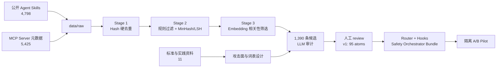

# Safety Orchestrator Distillation

一个面向 coding agent / LLM agent 的安全能力蒸馏与编排项目：从公开的 Agent Skills、MCP Server 元数据和行业安全资料中收集候选能力，经过去重、相关性筛选、LLM 审计和人工词表迭代，最终产出一个 **training-free Safety Orchestrator**。

项目的核心成果不是训练新的安全模型，而是把零散的安全实践整理为统一的 **95 个原子安全能力（atoms）**，并通过 Router meta-skill、模型推理型检查和确定性 hooks 将它们接入 Claude Code 与 OpenAI Codex。

> 当前状态：数据收集、三层筛选、LLM 审计、v1 词表和 bundle 包装已经完成；隔离环境中的 A/B Pilot 验证仍在进行。当前实现适合研究、审阅和试用，生产部署前仍需完成 Pilot 收敛与部分检测器加固。

如果你只想使用安全编排器，而不关心蒸馏过程，请直接查看 [`agent-safety-orchestrator/`](agent-safety-orchestrator/)。

## 项目成果

| 维度 | 当前结果 |
| --- | ---: |
| 原始候选 | **10,223**（4,798 个 SKILL.md skill + 5,425 条 MCP Server 记录） |
| 外部参考资料 | **11** 份标准、规范、研究与实践指南 |
| 三层漏斗残量 | **1,390**（1,046 skill + 344 MCP） |
| LLM 审计 | **1,390 / 1,390** 完成，1,211 条判定为 safety-relevant |
| 审计成本 | **$2.51**（DeepSeek，历史实验结果） |
| v1 安全词表 | **95 atoms / 19 archetypes / 5 phases** |
| 执行方式 | **60 hook / 21 hybrid / 14 skill** |
| 模型侧层级 | **1 Router meta-skill + 14 个按需读取的 archetype reference docs** |
| Host 支持 | Claude Code + OpenAI Codex |

## 端到端流程



三层漏斗遵循“先确定性、后语义筛选”的原则：

1. **Stage 1 — 硬去重**：对 SKILL.md 正文及 MCP `name + description` 计算指纹，10,223 → 10,032。
2. **Stage 2 — 近似去重与规则过滤**：过滤短内容和 branding-only 假阳性，通过规范化 GitHub URL 合并跨 registry MCP，并用 MinHash/LSH 合并近似 skill，10,032 → 8,053。
3. **Stage 3 — Embedding 排序**：使用智谱 `embedding-3` 与安全 archetype anchors 计算相似度，8,053 → 1,390。
4. **LLM 审计**：使用受控词表对 1,390 条候选标注安全相关性、主次 atoms、自身风险和潜在词表缺口。
5. **人工迭代与包装**：依据审计实证将词表冻结为 v1，并分流到 hook、hybrid 和 skill 三种 enforcement mode。

完整实验记录与设计依据见 [`docs/PROJECT_OVERVIEW.md`](docs/PROJECT_OVERVIEW.md)。

## Safety Orchestrator 如何工作

交付包位于 [`agent-safety-orchestrator/`](agent-safety-orchestrator/)，采用两层纵深防御：

- **Hook layer**：8 个 matcher 在用户输入、工具调用、工具输出和会话结束等事件上执行确定性检查；命中高风险规则时可在工具运行前阻断。
- **Skill layer**：`safety-router-skill` 是唯一顶层 skill。Router 根据 input understanding、planning、tool invocation、output generation 和 cross-cutting 五个阶段，按需让模型读取对应的 archetype 文档。
- **Hybrid checks**：hook 负责快速路径，模型推理负责难以通过规则完整表达的语义判断。
- **共享词表**：两层共用同一份 95-atom vocabulary，避免 host 规则与模型提示各自形成不一致的安全分类。

19 个 archetypes 中，14 个包含模型推理型检查并作为 Router reference docs 出货；另外 5 个是 pure-hook archetypes，只在始终启用的 hook layer 中执行。

## 快速开始

### 仅试用 Safety Orchestrator

当前 GitHub 仓库是包含研究数据与交付包的 monorepo。源码安装时需要进入内层 bundle 目录：

```bash
git clone https://github.com/tychenn/agent-safety-orchestrator.git safety-orchestrator-research
cd safety-orchestrator-research/agent-safety-orchestrator

./install.sh                 # 自动探测 Claude Code / Codex
./install.sh --host claude   # 仅 Claude Code
./install.sh --host codex    # 仅 Codex
./install.sh --host both     # 同时安装
```

安装器需要 `python3 >= 3.9`。Host 版本要求、fail policy 和 adapter 细节见 [bundle README](agent-safety-orchestrator/README.md)。

### 浏览研究结果

- [项目总览](docs/PROJECT_OVERVIEW.md)：完整实施过程、实验结果、当前进度和下一步。
- [原子能力词表](docs/SAFETY_ATOMIC_CAPABILITIES.md)：95 atoms 的定义、边界、phase 和 enforcement mode。
- [Archetype 设计](docs/SAFETY_ATOMIC_ARCHETYPES.md)：Stage 3 使用的语义 anchors 与分类设计。
- [Review Dashboard](reports/review_dashboard_v0.3.html)：词表审阅页面。
- [项目总览 HTML](docs/PROJECT_OVERVIEW.html)：适合浏览器阅读的可视化总览。
- [Pilot 指南](pilot/README.md)：隔离容器、A/B attribution 和审计日志说明。

## 复现实验

### 1. 准备环境

大部分 fetcher 和前两层漏斗只依赖 Python 标准库。Embedding、LLM 审计和 HTML 构建还需要少量第三方包：

```bash
python3 -m venv .venv
source .venv/bin/activate
python -m pip install numpy requests Markdown

cp .env.example .env
```

在 `.env` 中按需填写：

- `ZHIPU_API_KEY`：Stage 3 embedding；
- `DEEPSEEK_API_KEY`：LLM 审计。

已有报告和文档可以离线查看，不需要 API key。不要提交 `.env`；它已经被 `.gitignore` 排除。

### 2. 收集或更新原始数据

各数据源有独立、可重复运行的 fetcher。例如：

```bash
python3 scripts/fetch_openai_security_skills.py --help
python3 scripts/fetch_clawhub_security_skills.py --dry-run
python3 scripts/fetch_mcp_registry_security_servers.py --help
python3 scripts/fetch_security_references.py --help
```

完整来源矩阵、目录约定和重抓命令见 [`docs/SKILL_STORAGE_LAYOUT.md`](docs/SKILL_STORAGE_LAYOUT.md)。`data/raw/` 中的上游内容应保持原样，所有派生结果写入 `reports/`。

### 3. 运行三层漏斗与 LLM 审计

下面的命令使用同一个日期串串联每层 manifest：

```bash
RUN_DATE=$(date +%F)

python3 scripts/dedup_stage1_hash.py \
  --manifest-name "dedup_stage1_hash_${RUN_DATE}.json"

python3 scripts/dedup_stage2_filter.py \
  --stage1-manifest "reports/dedup_stage1_hash_${RUN_DATE}.json" \
  --manifest-name "dedup_stage2_filter_${RUN_DATE}.json"

python3 scripts/dedup_stage3_embedding.py \
  --stage2-manifest "reports/dedup_stage2_filter_${RUN_DATE}.json" \
  --manifest-name "dedup_stage3_embedding_${RUN_DATE}.json"

python3 scripts/llm_audit_stage1_classify.py \
  --stage3-manifest "reports/dedup_stage3_embedding_${RUN_DATE}.json" \
  --output "reports/llm_audit_classify_${RUN_DATE}.jsonl"
```

Stage 3 和 LLM 审计会调用付费 API。正式运行前可先使用 `--dry-run-embedding`、`--dry-run` 或 `--limit` 检查输入与成本；只调整 Stage 3 阈值时可使用 `--reselect-only` 复用本地 embedding cache。

### 4. 校验派生 bundle

```bash
python3 scripts/_atomic_capabilities.py
python3 scripts/gen_router_atom_catalog.py --check
python3 scripts/gen_archetype_skill_md.py --check
python3 scripts/vendor_plugin_docs.py --check
```

这些检查用于确认词表、Router catalog、14 个 archetype reference docs 和 bundle 内置文档没有漂移。

### 5. 运行隔离 Pilot

Pilot 需要 Podman（推荐 rootless）或 Docker：

```bash
./pilot/run.sh             # Bundle 模式
./pilot/run.sh --vanilla   # 无 bundle 的 A/B baseline
```

同一场景必须在 bundle 与 vanilla 两种模式下复现，才能区分 bundle 拦截、host 内建安全策略和模型自身拒绝。具体场景、日志位置与归因规则见 [`pilot/README.md`](pilot/README.md) 和 [`pilot/scenarios.md`](pilot/scenarios.md)。

## 仓库结构

| 路径 | 用途 |
| --- | --- |
| `agent-safety-orchestrator/` | 最终交付包：Router、hooks、helpers、Claude/Codex adapters |
| `data/raw/` | 上游原始 skills、MCP metadata 和安全参考资料 |
| `data/cache/` | 可重建的 embedding 等计算缓存，不进入 Git |
| `scripts/` | 数据抓取、三层漏斗、LLM 审计、词表与 bundle 生成脚本 |
| `reports/` | 去重 manifests、审计 JSONL、dashboard 和阶段性报告 |
| `docs/` | 项目总览、archetype 设计、95-atom 词表和存储规范 |
| `pilot/` | Claude Code 隔离容器、A/B 场景与审计产物 |
| `SafetyRouter.pdf` | 原始项目书 |

## 设计原则

- **Training-free**：不训练或微调模型，以 prompt、reference docs、hooks 和 adapters 完成部署。
- **Router-first**：模型侧只有一个顶层入口，archetype 文档按需加载，降低常驻上下文成本。
- **Defense in depth**：确定性 host hooks 与模型语义推理互补。
- **可追溯**：原始数据、每层筛选 manifest、LLM 审计和词表演化都保留证据链。
- **Fail explicitly**：依赖网络或外部服务的 atom 必须声明降级策略，不允许静默失效。
- **Upstream-identical raw data**：`data/raw/` 不做派生修改，转换结果与实验产物进入 `reports/`。

## 当前限制与下一步

- Pilot 的批量 TP/FP、routing-miss 和 phase latency 数据尚未全部收集完成。
- 部分 hook 检测器仍是轻量 representative implementation；生产版本应接入 Semgrep、完整 OSV snapshot 等能力。
- 14 个模型推理型 archetype 目前以 atom 描述为主，后续会根据 Pilot 数据补充更具体的 prompt templates。
- 当前仓库已改为 monorepo；bundle 的独立发布与 Claude plugin marketplace 根目录布局仍需在正式发布前再次校验。

## 数据来源与许可证

`data/raw/` 保存来自多个第三方项目、市场、注册表和标准组织的原始材料。它们各自保留原作者、来源和许可证约束；**根仓库中的全部数据不应被视为统一采用 MIT 许可证**。

可安装的 [`agent-safety-orchestrator/`](agent-safety-orchestrator/) bundle 采用 MIT License，详见 [`agent-safety-orchestrator/LICENSE`](agent-safety-orchestrator/LICENSE)。使用或再分发第三方原始数据前，请检查相应目录内的许可证及上游条款。
