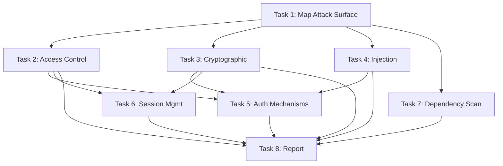

# Plan: Security Analysis of Authentication System

**Plan ID**: plan-20241124-154500
**Created**: 2025-11-24T15:45:00Z
**Status**: Approved
**Quality Score**: 94 / 100 ✅

---

## 1. Objective & Scope

### Primary Objective
Conduct comprehensive security analysis of the authentication system to identify vulnerabilities, verify OWASP Top 10 compliance, and provide prioritized remediation recommendations.

### Success Criteria
1. All authentication code analyzed for security issues
2. OWASP Top 10 (2021) compliance verified
3. All critical and high-priority vulnerabilities identified
4. Specific, actionable remediation steps provided
5. Security analysis report generated with priorities

### Scope

**Included**:
- Authentication implementation (login, registration, password reset)
- Session management
- Token generation and validation
- OAuth integrations (if present)
- Authorization middleware
- Security configuration (.env, secrets management)

**Excluded**:
- Authorization logic (role-based access control) - separate analysis
- Database security beyond auth tables
- Network/infrastructure security
- Third-party OAuth provider security

---

## 2. Approach & Strategy

**High-Level Approach**: Progressive security analysis using OWASP Top 10 as framework, combined with pattern-based vulnerability scanning and manual code review.

**Key Decisions**:
1. **Framework**: OWASP Top 10 (2021)
   - **Rationale**: Industry standard, comprehensive coverage
   - **Alternatives**: CWE Top 25, SANS Top 25 - chose OWASP for web app focus

2. **Analysis Method**: Hybrid automated + manual
   - **Rationale**: Automated finds common issues, manual catches logic flaws

**Risks & Mitigations**:
1. **Risk**: False positives from automated tools
   - **Probability**: Medium
   - **Impact**: Medium (wasted time investigating)
   - **Mitigation**: Manual verification of all automated findings

2. **Risk**: Missing context-specific vulnerabilities
   - **Probability**: Medium
   - **Impact**: High (undetected vulnerabilities)
   - **Mitigation**: Multi-layer analysis (automated + pattern scan + manual review)

---

## 3. Task Breakdown

### Task 1: Map Authentication Attack Surface
- **ID**: 1
- **Level**: Large
- **Description**: Identify all authentication-related code, endpoints, and configurations
- **Dependencies**: None
- **Estimated**: 2 hours
- **Agent Suggestion**: code-analyzer
- **Status**: ✅ Complete

**Success Criteria**:
- [ ] All auth-related files identified (glob pattern used)
- [ ] All auth endpoints mapped (/login, /register, etc.)
- [ ] All session management code located
- [ ] Configuration files analyzed (.env, config/)
- [ ] Attack surface map document created

**Verification Method**: manual_check
**Verification Commands**:
```bash
# Verify attack surface map exists
test -f attack-surface-map.md

# Check it includes all key components
grep -q "login\|register\|session\|token\|oauth" attack-surface-map.md
```

---

### Task 2: OWASP A01 - Broken Access Control Analysis
- **ID**: 2
- **Level**: Large
- **Description**: Analyze for broken access control vulnerabilities
- **Dependencies**: Task 1 (needs attack surface map)
- **Estimated**: 1.5 hours
- **Agent Suggestion**: security-analyzer
- **Status**: ✅ Complete

**Success Criteria**:
- [ ] All authorization checks reviewed
- [ ] Privilege escalation paths checked
- [ ] Session management validated
- [ ] CORS configuration reviewed
- [ ] Issues documented with severity

**Verification Method**: code_review + automated_test
**Verification Commands**:
```bash
# Check for missing authorization
grep -r "req\.user\|req\.session" src/api/ | grep -v "if.*req\.user"

# Verify tests exist
test -f tests/security/access-control.test.ts
npm test -- tests/security/access-control.test.ts
```

---

### Task 3: OWASP A02 - Cryptographic Failures
- **ID**: 3
- **Level**: Large
- **Description**: Analyze cryptographic implementations for weaknesses
- **Dependencies**: Task 1
- **Estimated**: 1.5 hours
- **Status**: ✅ Complete

**Medium Tasks**:
- 3.1: Password hashing analysis (bcrypt/argon2 review)
- 3.2: Token generation analysis (JWT security)
- 3.3: Secret management review (.env, key storage)
- 3.4: TLS/HTTPS configuration check

**Success Criteria**:
- [ ] Password hashing uses strong algorithm (bcrypt rounds ≥10 or argon2)
- [ ] No hardcoded secrets in code
- [ ] JWT secrets are strong (≥32 bytes)
- [ ] All sensitive data encrypted at rest
- [ ] TLS 1.2+ enforced

**Verification Method**: automated_test + code_review
**Verification Commands**:
```bash
# Check for hardcoded secrets
grep -r "password\s*=\s*['\"]" src/ && exit 1 || echo "✅ No hardcoded passwords"

# Verify bcrypt rounds
grep -r "bcrypt\|argon2" src/auth/ | grep -E "rounds|iterations"

# Check JWT secret length
grep "JWT_SECRET" .env.example
```

---

### Task 4: OWASP A03 - Injection Vulnerabilities
- **ID**: 4
- **Level**: Large
- **Description**: Analyze for SQL injection, XSS, command injection vulnerabilities
- **Dependencies**: Task 1
- **Estimated**: 2 hours
- **Status**: 🔄 In Progress

**Medium Tasks**:
- 4.1: SQL injection analysis (parameterized queries)
- 4.2: XSS vulnerability analysis (input sanitization)
- 4.3: Command injection analysis (shell execution)

**Success Criteria**:
- [ ] All database queries use parameterized statements
- [ ] All user input sanitized before display
- [ ] No eval() or exec() on user input
- [ ] Input validation on all auth endpoints
- [ ] Output encoding implemented

**Verification Method**: automated_test + code_review
**Verification Commands**:
```bash
# Check for SQL injection risk
grep -r "query.*\+\|query.*\${" src/ && echo "⚠️  String concatenation found"

# Check for XSS risk
grep -r "innerHTML\|dangerouslySetInnerHTML" src/

# Run security tests
npm test -- tests/security/injection.test.ts
```

---

### Task 5: Authentication Mechanism Review
- **ID**: 5
- **Level**: Large
- **Description**: Analyze login, registration, password reset flows
- **Dependencies**: Tasks 2, 3, 4 (needs to understand access control, crypto, injection protection)
- **Estimated**: 2.5 hours
- **Status**: ⬜ Pending

**Medium Tasks**:
- 5.1: Login flow security analysis
- 5.2: Registration flow analysis
- 5.3: Password reset security (token generation, expiry)
- 5.4: Multi-factor authentication (if present)
- 5.5: Rate limiting analysis

**Success Criteria**:
- [ ] Login implements rate limiting (max 5 attempts)
- [ ] Passwords meet complexity requirements
- [ ] Password reset tokens expire (15-60 min)
- [ ] Account lockout after failed attempts
- [ ] MFA implementation secure (if present)

---

### Task 6: Session Management Analysis
- **ID**: 6
- **Level**: Large
- **Description**: Analyze session handling, cookie security, token management
- **Dependencies**: Task 2, 3
- **Estimated**: 1.5 hours
- **Status**: ⬜ Pending

**Success Criteria**:
- [ ] Session tokens regenerated on login
- [ ] Cookies have HttpOnly, Secure, SameSite flags
- [ ] Session timeout implemented (reasonable duration)
- [ ] Logout properly invalidates sessions
- [ ] No session fixation vulnerabilities

---

### Task 7: Dependency Vulnerability Scan
- **ID**: 7
- **Level**: Medium
- **Description**: Scan authentication dependencies for known vulnerabilities
- **Dependencies**: Task 1 (needs package list)
- **Estimated**: 1 hour
- **Status**: ⬜ Pending

**Success Criteria**:
- [ ] npm audit or yarn audit executed
- [ ] All critical vulnerabilities documented
- [ ] Update plan for vulnerable packages
- [ ] Alternative packages identified if needed

**Verification Commands**:
```bash
npm audit --json > audit-results.json
npm audit --audit-level=critical
```

---

### Task 8: Security Report Generation
- **ID**: 8
- **Level**: Medium
- **Description**: Compile all findings into prioritized security report
- **Dependencies**: Tasks 2, 3, 4, 5, 6, 7 (needs all analysis complete)
- **Estimated**: 1.5 hours
- **Status**: ⬜ Pending

**Success Criteria**:
- [ ] All findings categorized (Critical/High/Medium/Low)
- [ ] Each finding has file:line reference
- [ ] Remediation steps specific and actionable
- [ ] OWASP Top 10 coverage documented
- [ ] Priority implementation order defined

**Deliverables**:
- security-analysis-report.md
- findings-by-severity.json
- remediation-plan.md

---

## 4. Dependency Map

### Dependency Graph



### Parallel Execution Opportunities

**Phase 1** (Immediate):
- Task 1: Map Attack Surface
**Agents**: 1
**Time**: 2h

**Phase 2** (After Task 1):
- Task 2: Access Control Analysis
- Task 3: Cryptographic Analysis
- Task 4: Injection Analysis
- Task 7: Dependency Scan
**Agents**: 4 parallel ⚡
**Time**: 2h (max duration)

**Phase 3** (After Tasks 2, 3, 4):
- Task 5: Auth Mechanism Review
- Task 6: Session Management
**Agents**: 2 parallel ⚡
**Time**: 2.5h

**Phase 4** (After all analysis):
- Task 8: Report Generation
**Agents**: 1
**Time**: 1.5h

**Total Sequential**: 13.5h
**With Parallelization**: 8h (41% time savings)

---

## 5. Verification Strategy

### Per-Task Verification
Each task includes specific success criteria and verification method (see task details above).

### Quality Gates

**Gate 1: Attack Surface Mapped**
- [ ] All auth code identified
- [ ] All endpoints documented
- [ ] Configuration reviewed

**Gate 2: OWASP Analysis Complete**
- [ ] A01-A10 all analyzed
- [ ] Findings documented
- [ ] Code references included

**Gate 3: Report Generated**
- [ ] All findings in report
- [ ] Severity assigned
- [ ] Remediation steps clear
- [ ] Prioritized action plan

---

## 6. Checkpoint Strategy

### CP-001: After Task 1
- **Description**: Attack surface mapped
- **Safe Rollback**: Yes
```bash
git commit -m "Checkpoint 1: Attack surface mapped"
git tag -a cp-001 -m "Attack surface analysis complete"
```

### CP-002: After Tasks 2-4, 7
- **Description**: OWASP analysis complete
- **Safe Rollback**: Yes
```bash
git commit -m "Checkpoint 2: OWASP analysis"
git tag -a cp-002 -m "Vulnerability analysis complete"
```

---

## 7. Quality Score: 94/100 ✅

- **Comprehensiveness**: 19/20 (excellent coverage)
- **Feasibility**: 19/20 (all resources available)
- **Clarity**: 19/20 (clear task descriptions)
- **Executability**: 18/20 (all tasks verifiable)
- **Integration**: 19/20 (well-integrated analysis)

**Status**: ✅ APPROVED FOR EXECUTION

---

## 8. Execution Status

**Progress**: 3/8 tasks complete (38%)
**Estimated Remaining**: 5h (with parallelization)

**Next Steps**:
1. Complete Task 4 (Injection analysis) - in progress
2. Launch parallel Tasks 5 & 6
3. Finalize with Task 8 (Report)

---

**This example demonstrates**: Hierarchical decomposition, dependency mapping, parallel optimization, verification-first approach, and quality validation ≥90/100.
