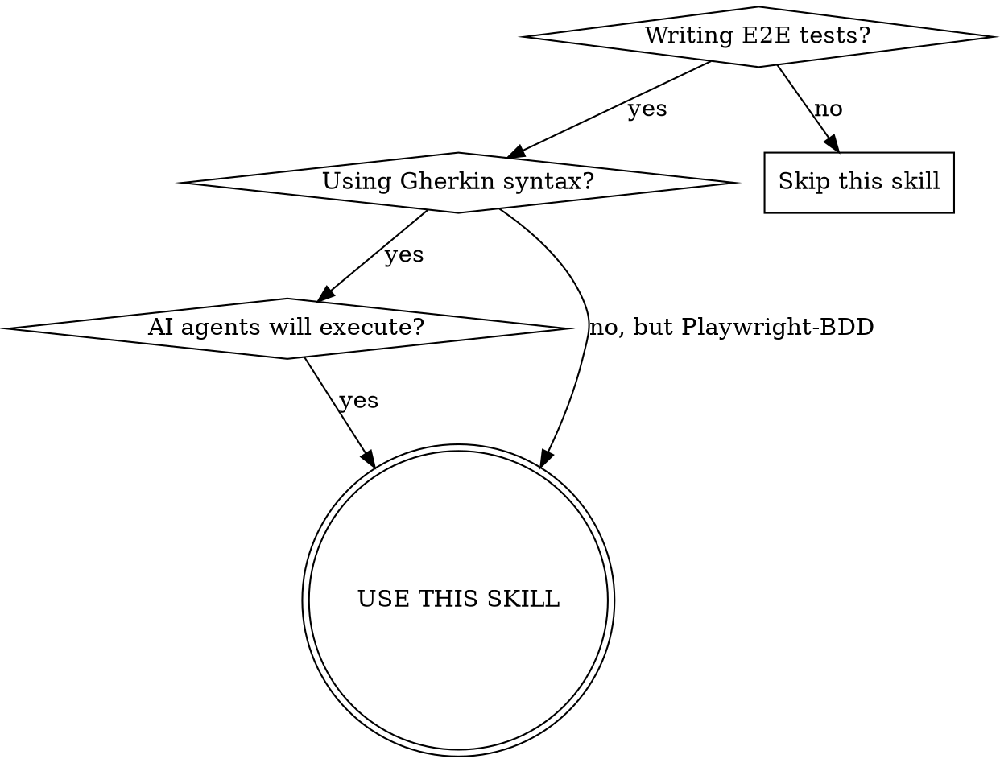
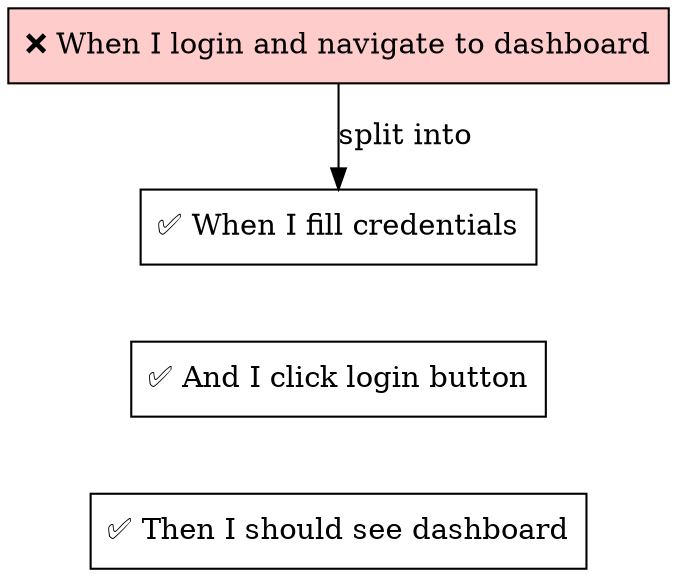

# BDD Best Practices for Gherkin + Playwright + AI Agents

Used by the `auditing-bdd-tests` skill.

## Contents

- [Overview](#overview)
- [When to Use](#when-to-use)
- [The Layered Architecture](#the-layered-architecture)
- [File Organization](#file-organization)
- [Gherkin Principles](#gherkin-principles)
- [Locator Strategy](#locator-strategy) ← **Semantic/a11y-first approach**
- [Test Isolation](#test-isolation)
- [Waiting Strategy](#waiting-strategy)
- [Web First Assertions](#web-first-assertions)
- [Accessibility Testing Integration](#accessibility-testing-integration) ← **@axe-core/playwright**
- [Visual Testing Integration](#visual-testing-integration)
- [AI Agent Considerations](#ai-agent-considerations) ← **A11y = AI-friendly**
- [Summary](#summary)

## Overview

BDD tests serve as **executable documentation**. The `.feature` file is the single source of truth for system behavior. If a business rule isn't visible in the `.feature` file, it doesn't exist.

**Core principle:** Scenarios must be understandable by non-technical stakeholders AND executable by AI agents without ambiguity.

**Key insight:** Tests built on **semantic HTML and accessibility** are inherently AI-agent friendly. Both AI agents and screen readers rely on ARIA roles, accessible names, and semantic structure to understand and interact with web pages.

## When to Use



**Use when:**
- Writing `.feature` files with Gherkin syntax
- Implementing step definitions for Playwright
- AI agents execute test scenarios (MCP, test-engine)
- Tests are flaky, unclear, or hard to maintain
- Hidden logic causes debugging nightmares

**Don't use when:**
- Unit tests without BDD layer
- API-only tests without UI
- Performance/load testing

---

## The Layered Architecture

| Layer | Responsibility | Example |
|-------|---------------|---------|
| **Gherkin** | Business intent (WHAT) | `When the user logs in` |
| **Step Definitions** | Wiring (HOW to call) | `await auth.login(user)` |
| **Fixtures/Utils** | Mechanics (HOW it works) | `page.fill('#email', email)` |

**Rule:** No complex logic in Step Definitions. Loops, conditions, retries belong in Fixtures/Utils.

### Framework vs Project-Specific Code

| Type | Location | Example |
|------|----------|---------|
| Framework code | `support/` | Step definitions, fixtures, utils |
| Project-specific | Root or `data/` | Test constants, URLs, page configs |

**Why separate?** Makes framework reusable across projects. Step definitions should work with any application.

---

## File Organization

### Naming Conventions

| File Type | Convention | Example |
|-----------|------------|---------|
| Feature files | kebab-case | `user-login.feature` |
| Step definitions | kebab-case + `.sd.ts` | `authentication.sd.ts` |
| Fixtures | kebab-case + `.fixture.ts` | `test-data.fixture.ts` |
| Utilities | kebab-case | `locator-helpers.ts` |

### Folder Structure

```
features/           # Gherkin scenarios
  regression/
  smoke/
  components/
support/            # Framework code
  fixtures/         # Playwright fixtures
  step_definitions/ # Step implementations
  utils/            # Helper functions
tests/              # Non-BDD Playwright tests (optional)
```

**Prefer kebab-case** for new folders: `step-definitions/` not `step_definitions/`

---

## Gherkin Principles

### 1. Atomic Steps



**One step = one action.** Click is click. Fill is fill. Assert is assert.

### 2. Explicit Over Implicit

```gherkin
# ❌ BAD: Hidden logic, vague outcome
Then the form should work correctly

# ✅ GOOD: Explicit, verifiable, semantic
Then the alert with text "Success" should be visible
And the alert with text "Error" should not exist

# ✅ ALSO GOOD: Role-based
Then the element with role "alert" and name "Success" should be visible
```

**All assertions belong in explicit `Then` steps.** Never bury `expect()` inside `When` steps.

### 3. No Hidden Branching

```gherkin
# ❌ BAD: Step behaves differently based on device
When I navigate to home
# (internally: if mobile → tap menu, else → click nav)

# ✅ GOOD: Explicit scenarios per device
@mobile
Scenario: Navigate on mobile
  When I tap the menu icon
  And I tap "Home"

@desktop
Scenario: Navigate on desktop
  When I click the "Home" link
```

**If behavior differs by condition, use separate scenarios with tags.**

### 4. Descriptive Outcomes, Not Implementation

```gherkin
# ❌ BAD: Implementation detail
Then I wait for the page to reload

# ✅ GOOD: Observable outcome
Then the page should be loaded
Then the element with text "Welcome" should be visible
```

---

## Locator Strategy

Playwright recommends **prioritizing user-facing attributes** and **semantic locators** that reflect how users and assistive technology perceive the page. This approach benefits both accessibility and AI agent operability.

### Priority Order (Playwright Recommended)

| Priority | Method | Use Case | Example |
|----------|--------|----------|---------|
| 1 | `getByRole()` | Interactive elements by ARIA role + name | `getByRole('button', { name: 'Submit' })` |
| 2 | `getByLabel()` | Form inputs by associated label | `getByLabel('Email address')` |
| 3 | `getByPlaceholder()` | Inputs without labels | `getByPlaceholder('Enter email')` |
| 4 | `getByText()` | Non-interactive elements | `getByText('Welcome back')` |
| 5 | `getByAltText()` | Images by alt attribute | `getByAltText('Company logo')` |
| 6 | `getByTitle()` | Elements with title attribute | `getByTitle('Close dialog')` |
| 7 | `getByTestId()` | Fallback for complex cases | `getByTestId('complex-widget')` |
| 8 | CSS/XPath | **Avoid** — brittle, DOM-dependent | — |

### Why Role-First Matters

```typescript
// ❌ BAD: Tied to CSS implementation
page.locator('button.buttonIcon.episode-actions-later');

// ✅ GOOD: Semantic, resilient to style changes
page.getByRole('button', { name: 'Watch later' });
```

**Benefits:**
- Reflects how users and screen readers perceive the page
- Self-documenting and intent-revealing
- Survives CSS refactoring if semantics stay consistent
- AI agents understand semantic structure naturally

### ARIA Roles Reference

Common roles for `getByRole()`:
- `button` — clickable buttons
- `link` — anchor links
- `checkbox`, `radio` — toggle inputs
- `textbox` — text inputs
- `combobox` — dropdowns with text input
- `listbox`, `option` — select lists
- `heading` — h1–h6 (use `{ level: 2 }`)
- `navigation`, `main`, `banner`, `contentinfo` — page regions
- `dialog`, `alertdialog` — modals
- `alert` — important messages
- `table`, `row`, `cell` — data tables

### Semantic HTML = Better Locators

| Instead of | Use | Enables |
|------------|-----|---------|
| `<div onclick>` | `<button>` | `getByRole('button')` |
| `<div class="nav">` | `<nav>` | `getByRole('navigation')` |
| `<span class="link">` | `<a href>` | `getByRole('link')` |
| `<input>` without label | `<label><input/></label>` | `getByLabel()` |
| `<div role="button">` | `<button>` | Native semantics |

### Forbidden Patterns

| Pattern | Why Bad | Alternative |
|---------|---------|-------------|
| `.css-1s6g5p9` | Generated, changes on rebuild | `getByRole()` or `getByTestId()` |
| `div > div:nth-child(3)` | Brittle, layout-dependent | Semantic role locator |
| `//div/span[2]/a[1]` | Deep XPath, breaks easily | `getByRole('link', { name })` |
| `#ember123` | Framework-generated IDs | Add stable test ID |
| `page.locator('.btn-primary')` | Class-based, non-semantic | `getByRole('button', { name })` |

### Accessible Names

The `name` option in `getByRole()` matches the **accessible name** of an element, which comes from:
1. Text content: `<button>Submit</button>` → name is "Submit"
2. `aria-label`: `<button aria-label="Close">×</button>` → name is "Close"
3. `aria-labelledby`: references another element's text
4. Associated `<label>` for form inputs

```typescript
// All these work if accessible name is "Submit"
page.getByRole('button', { name: 'Submit' });
page.getByRole('button', { name: /submit/i }); // regex
```

### ARIA States for Interactive Components

Many interactive components use ARIA states that can be tested:

| State | Use Case | Example |
|-------|----------|---------|
| `aria-expanded` | Dropdowns, accordions | `getByRole('button', { expanded: true })` |
| `aria-checked` | Checkboxes, toggles | `getByRole('checkbox', { checked: true })` |
| `aria-selected` | Tabs, list items | `getByRole('tab', { selected: true })` |
| `aria-pressed` | Toggle buttons | `getByRole('button', { pressed: true })` |
| `aria-disabled` | Disabled elements | `getByRole('button', { disabled: true })` |

```typescript
// Test dropdown is expanded
await page.getByRole('button', { name: 'Options' }).click();
await expect(page.getByRole('button', { name: 'Options', expanded: true })).toBeVisible();

// Test checkbox state
await expect(page.getByRole('checkbox', { name: 'Subscribe', checked: true })).toBeVisible();

// Test tab selection
await expect(page.getByRole('tab', { name: 'Settings', selected: true })).toBeVisible();
```

### Chaining and Filtering

Use chaining to narrow down locators:

```typescript
// Find "Add to cart" button within a specific product
const product = page.getByRole('listitem').filter({ hasText: 'Product 2' });
await product.getByRole('button', { name: 'Add to cart' }).click();
```

### Locator Mapping Pattern (for BDD)

```gherkin
Background:
  Given I map page locators
      """
      Submit Button: role=button[name="Submit"]
      Email Input: role=textbox[name="Email"]
      Error Message: role=alert
      """

Scenario: Form validation
  When I click on the element with selector "<Submit Button>"
  Then the element with selector "<Error Message>" should be visible
```

---

## Test Isolation

Playwright recommends **complete test isolation** — each test should run independently with its own storage, session, cookies, and data.

### Why Isolation Matters

| Problem | Cause | Solution |
|---------|-------|----------|
| Flaky tests | Shared state between tests | Isolate each test |
| Order-dependent tests | Test A sets up for test B | Each test sets up its own state |
| Debugging nightmares | Failure cascades | Isolated failures are easier to debug |
| Parallel execution fails | Race conditions on shared data | Parallel-safe isolation |

### Patterns for Isolation

```typescript
test.beforeEach(async ({ page }) => {
  await page.goto('https://example.com/login');
  await page.getByLabel('Username').fill('testuser');
  await page.getByLabel('Password').fill('password');
  await page.getByRole('button', { name: 'Sign in' }).click();
});

test('first test', async ({ page }) => {
  // page is signed in, isolated from other tests
});

test('second test', async ({ page }) => {
  // page is signed in, isolated from other tests
});
```

### Gherkin for Isolation

```gherkin
# ❌ BAD: Relies on previous scenario
Scenario: View dashboard
  Then the dashboard should show user data

# ✅ GOOD: Self-contained
Scenario: View dashboard after login
  Given I am logged in as "testuser"
  When I navigate to the dashboard
  Then the dashboard should show user data
```

---

## Waiting Strategy

### Explicit Waits (Preferred)

```gherkin
Then I wait 25 seconds for the element with text "Loaded" to be visible
Then I wait 10 seconds for the button with name "Submit" to be enabled
```

### When Short Sleep is Acceptable

```gherkin
When I click on the dropdown
Then the element with selector ".options" should be visible
When I wait 300 milliseconds for animation
Then the visual snapshot matches "dropdown expanded"
```

### Never Do This

```gherkin
When I wait 2 seconds
When I click on button
When I wait 3 seconds
Then something should happen
```

---

## Web First Assertions

Playwright recommends **web first assertions** that auto-wait and retry until expected condition is met.

```typescript
// ✅ GOOD: Web first assertion — waits and retries
await expect(page.getByText('Welcome')).toBeVisible();
await expect(page.getByRole('button', { name: 'Submit' })).toBeEnabled();

// ❌ BAD: Manual assertion — no waiting, flaky
expect(await page.getByText('Welcome').isVisible()).toBe(true);
```

**Key web first assertions:**
- `toBeVisible()` / `toBeHidden()` — visibility state
- `toBeEnabled()` / `toBeDisabled()` — interactivity state
- `toHaveText()` / `toContainText()` — text content
- `toHaveValue()` — input values
- `toHaveAttribute()` — attribute values
- `toHaveCount()` — number of elements

---

## Accessibility Testing Integration

Use **@axe-core/playwright** to catch semantic/a11y issues during test runs. This ensures the application supports role-based locators.

### Setup

```bash
npm install -D @axe-core/playwright
```

### Basic Usage

```typescript
import { test, expect } from '@playwright/test';
import AxeBuilder from '@axe-core/playwright';

test('page should have no a11y violations', async ({ page }) => {
  await page.goto('/');
  
  const results = await new AxeBuilder({ page }).analyze();
  expect(results.violations).toEqual([]);
});
```

### Targeted Scans

```typescript
// Scan specific component
const results = await new AxeBuilder({ page })
  .include('#checkout-form')
  .analyze();

// Exclude dynamic regions
const results = await new AxeBuilder({ page })
  .exclude('.third-party-widget')
  .analyze();

// Focus on specific rules
const results = await new AxeBuilder({ page })
  .withRules(['button-name', 'label', 'link-name'])
  .analyze();
```

### Common Issues Detected

| Violation | Impact | Locator Problem |
|-----------|--------|-----------------|
| `button-name` | Buttons without accessible name | `getByRole('button', { name })` fails |
| `label` | Inputs without labels | `getByLabel()` fails |
| `link-name` | Links without text | `getByRole('link', { name })` fails |
| `image-alt` | Images without alt | `getByAltText()` fails |
| `region` | Content not in landmarks | Hard to scope locators |

### BDD Integration

```gherkin
Scenario: Checkout page is accessible
  Given I am on the checkout page
  Then the page should have no critical accessibility violations
  And all form inputs should have associated labels
```

---

## Visual Testing Integration

Prefer visual snapshots for layout/styling; use DOM assertions for specific values.

---

## AI Agent Considerations

AI agents perceive web pages similarly to screen readers — through **semantic structure, accessibility attributes, and visible text**. Tests built on a11y best practices are inherently AI-agent friendly.

### The A11y–AI Connection

| What AI agents need | A11y equivalent |
|---------------------|-----------------|
| Know what element does | ARIA role (`button`, `link`, `textbox`) |
| Identify element uniquely | Accessible name (label, aria-label) |
| Understand page structure | Landmark roles (`main`, `navigation`, `banner`) |
| Read visible content | Text content, alt text, visible labels |
| Know element state | ARIA states (`aria-expanded`, `aria-checked`) |

### Test User-Visible Behavior

From Playwright docs: *"Automated tests should verify that the application code works for the end users, and avoid relying on implementation details."*

```typescript
// ❌ BAD: Tests implementation detail
await expect(page.locator('.loading-spinner')).toHaveClass('hidden');

// ✅ GOOD: Tests what user sees
await expect(page.getByRole('button', { name: 'Submit' })).toBeEnabled();
await expect(page.getByText('Welcome, John!')).toBeVisible();
```

### Principles for AI-Agent Operability

1. **Semantic targeting** — Use `getByRole()` as primary locator strategy
2. **Accessible names** — All interactive elements need descriptive names
3. **No randomness** — Same input = same output
4. **Explicit selectors** — No "find the button" guessing
5. **Clear success/failure** — Binary outcomes with visible assertions
6. **No hidden state** — All context visible in scenario
7. **Visible behavior** — Test what users see, not implementation

### Gherkin for AI Agents

```gherkin
# ❌ BAD: Ambiguous, implementation-focused
When I click the submit button
Then the form should be processed

# ✅ GOOD: Explicit, user-visible behavior
When I click the button with name "Submit order"
Then the heading "Order confirmed" should be visible
And the text "Order #12345" should be visible
```

### Making Tests Self-Documenting

When selectors use semantic attributes, tests become self-explanatory:

```typescript
// This code explains itself
await page.getByRole('navigation').getByRole('link', { name: 'Products' }).click();
await page.getByRole('heading', { name: 'All Products' }).waitFor();
await page.getByRole('listitem').filter({ hasText: 'Widget' })
  .getByRole('button', { name: 'Add to cart' }).click();
await expect(page.getByRole('status')).toHaveText('Added to cart');
```

Compare to CSS-based equivalent that requires context to understand:
```typescript
await page.locator('.nav-menu .nav-link.products').click();
await page.locator('h1.page-title').waitFor();
await page.locator('.product-list .product-item:has-text("Widget") .add-btn').click();
await expect(page.locator('.toast-message')).toHaveText('Added to cart');
```

---

## Summary

1. Feature files are executable documentation
2. One step = one action
3. Explicit over implicit
4. **Semantic locators first** — `getByRole()` before CSS/XPath
5. **Accessibility enables AI** — a11y best practices = AI-agent friendly tests
6. Condition-based waits
7. Deterministic behavior
8. **Test user-visible behavior**, not implementation details
9. Visual-first for UI where appropriate
10. Tags for organization
11. Artifacts over retries
12. **AI agents = screen readers** — both rely on semantic structure
